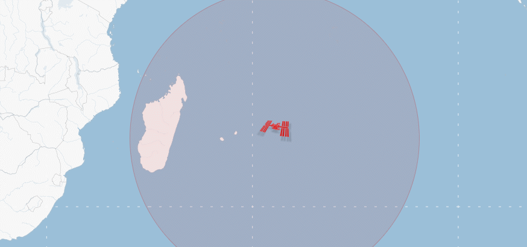
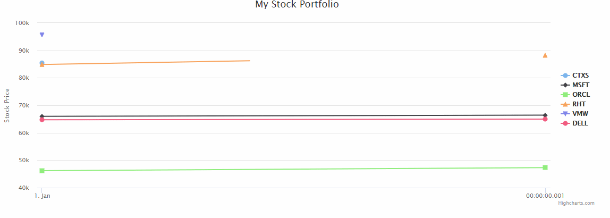

### 使用vertx实现响应式——数据实时展示在前端界面
1. 启动项目在浏览器运行[http://127.0.0.1:9002/index.html](http://127.0.0.1:9002/index.html)或者[http://127.0.0.1:9002/quotes.html](http://127.0.0.1:9002/quotes.html)即可看到效果
效果图如下：
- index.html

- quotes.html

